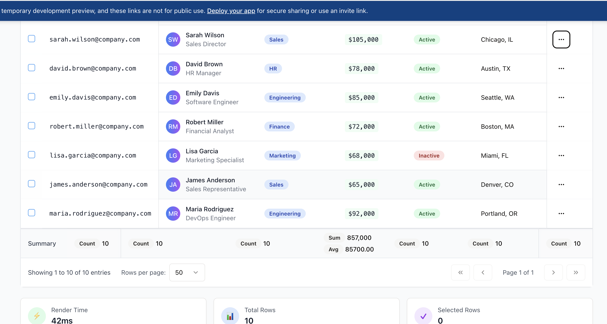

# Advanced React DataTable



A comprehensive React data grid component with advanced features like pinned columns, inline editing, grouping, filtering, and export capabilities. Built with TypeScript and Tailwind CSS for maximum flexibility and performance.

## ✨ Features

### Core Functionality
- **Multi-Column Sorting** - Sort by multiple columns with visual indicators  
- **Advanced Filtering** - Column-specific filters with various operators
- **Multiselect Filters** - Select multiple values with checkbox interface  
- **Grouping & Aggregation** - Multi-level grouping with automatic summaries
- **Pagination** - Configurable page sizes and smooth navigation
- **Row Selection** - Single, multiple, or disabled selection modes

### Advanced Features
- **Pinned Columns** - Pin columns to left or right with visual separation
- **Inline Editing** - Double-click cells to edit with type-specific editors
- **Column Management** - Show/hide, reorder, and configure columns via modal
- **CSV Export** - Export filtered and grouped data
- **Sticky Headers** - Keep headers visible while scrolling
- **Horizontal Scrolling** - Handle tables with many columns gracefully
- **Responsive Design** - Mobile-friendly with adaptive layouts

### Technical Features
- **TypeScript** - Full type safety and IntelliSense support
- **Auto-Generated Filter Options** - Automatically collect unique values from data
- **Custom Renderers** - Override column headers and cell templates
- **Accessibility** - ARIA compliant with keyboard navigation
- **Themeable** - Built with Tailwind CSS for easy customization

## 📦 Installation

```bash
npm install advanced-react-datatable
```

### Required Dependencies

Install the peer dependencies:
```bash
npm install react react-dom @types/react @types/react-dom
```

Install the UI dependencies:
```bash
npm install @radix-ui/react-accordion @radix-ui/react-checkbox @radix-ui/react-dialog @radix-ui/react-dropdown-menu @radix-ui/react-label @radix-ui/react-popover @radix-ui/react-scroll-area @radix-ui/react-select @radix-ui/react-separator @radix-ui/react-slot @radix-ui/react-switch @radix-ui/react-tabs @radix-ui/react-tooltip class-variance-authority clsx lucide-react tailwind-merge
```

### Tailwind CSS Setup

Add to your `tailwind.config.js`:
```javascript
module.exports = {
  content: [
    "./src/**/*.{js,ts,jsx,tsx}",
    "./node_modules/advanced-react-datatable/dist/**/*.{js,ts,jsx,tsx}"
  ],
  theme: {
    extend: {
      // Your custom theme
    }
  },
  plugins: []
}
```

## 🚀 Usage

### Basic Example

```tsx
import { DataTable } from 'advanced-react-datatable';
import type { DataTableColumn } from 'advanced-react-datatable';

interface Employee {
  id: number;
  name: string;
  email: string;
  department: string;
  salary: number;
  active: boolean;
}

const columns: DataTableColumn<Employee>[] = [
  {
    field: 'name',
    header: 'Full Name',
    sortable: true,
    filterable: true,
    pinned: 'left',
    minWidth: 200
  },
  {
    field: 'email',
    header: 'Email',
    sortable: true,
    filterable: true,
    minWidth: 250
  },
  {
    field: 'department',
    header: 'Department',
    type: 'select', // Enables multiselect filter
    sortable: true,
    filterable: true,
    groupable: true,
    minWidth: 150
  },
  {
    field: 'salary',
    header: 'Salary',
    type: 'number',
    sortable: true,
    filterable: true,
    minWidth: 120
  },
  {
    field: 'active',
    header: 'Status',
    type: 'boolean', // Enables multiselect filter
    sortable: true,
    filterable: true,
    minWidth: 100
  }
];

const employees: Employee[] = [
  {
    id: 1,
    name: 'John Doe',
    email: 'john@example.com',
    department: 'Engineering',
    salary: 75000,
    active: true
  },
  // ... more data
];

function App() {
  return (
    <DataTable
      data={employees}
      columns={columns}
      pageSize={25}
      selectionMode="multiple"
      showFilters
      showColumnConfig
      onRowSelect={(selected) => console.log('Selected:', selected)}
      onExport={(data, format) => console.log('Export:', format, data)}
    />
  );
}
```

## ☑️ Checkbox Column Configuration

To enable row selection with checkboxes, configure the `selectionMode` prop:

```tsx
<DataTable 
  data={data} 
  columns={columns}
  selectionMode="multiple"  // Options: 'single', 'multiple', 'none'
  onRowSelect={(selectedRows) => {
    console.log('Selected rows:', selectedRows);
  }}
/>
```

**Selection Mode Options:**
- `"multiple"` - Shows checkbox column, allows selecting multiple rows
- `"single"` - Shows radio buttons, allows selecting one row at a time  
- `"none"` - No selection column (default)

**Checkbox Column Features:**
- Automatically adds a checkbox column as the first column
- Header checkbox selects/deselects all rows
- Individual row checkboxes for granular selection
- Integrates with grouping - toggle buttons appear in checkbox column
- Compact spacing optimized for selection interactions

### Custom Cell Renderers

```tsx
import { Badge } from '@/components/ui/badge';
import { Button } from '@/components/ui/button';

const columns: DataTableColumn<Employee>[] = [
  {
    field: 'name',
    header: 'Employee',
    cellRenderer: (value, row) => (
      <div className="flex items-center gap-2">
        <div className="h-8 w-8 rounded-full bg-blue-500 flex items-center justify-center text-white text-sm">
          {row.name.charAt(0)}
        </div>
        <span className="font-medium">{value}</span>
      </div>
    )
  },
  {
    field: 'salary',
    header: 'Salary',
    type: 'number',
    cellRenderer: (value) => `$${value.toLocaleString()}`
  },
  {
    field: 'active',
    header: 'Status',
    type: 'boolean',
    cellRenderer: (value) => (
      <Badge variant={value ? 'default' : 'secondary'}>
        {value ? 'Active' : 'Inactive'}
      </Badge>
    )
  }
];
```

### Multiselect Filters

The component automatically enables multiselect filters for columns with `type: 'select'` or `type: 'boolean'`. Options are automatically collected from your data:

```tsx
const columns: DataTableColumn<Employee>[] = [
  {
    field: 'department',
    header: 'Department',
    type: 'select', // Automatically creates multiselect with all unique department values
    filterable: true
  },
  {
    field: 'active',
    header: 'Status',
    type: 'boolean', // Creates multiselect with true/false options
    filterable: true
  }
];
```

Features of multiselect filters:
- Checkbox interface for selecting multiple values
- "X selected" indicator when multiple items are chosen
- Clear button to reset selections
- Badge display showing selected values
- Auto-populated from actual data (no manual configuration needed)

### Grouping and Aggregation

```tsx
<DataTable
  data={employees}
  columns={columns}
  groupBy="department"
  pageSize={100}
  onGroupByChange={(field) => console.log('Group by:', field)}
/>
```

### Inline Editing

```tsx
<DataTable
  data={employees}
  columns={columns.map(col => ({ 
    ...col, 
    editable: col.field !== 'id' 
  }))}
  onCellEdit={(row, field, value) => {
    console.log('Edit:', { row, field, value });
    // Update your data source
  }}
/>
```

## 🎯 API Reference

### DataTable Props

| Prop | Type | Default | Description |
|------|------|---------|-------------|
| `data` | `T[]` | Required | Array of data objects |
| `columns` | `DataTableColumn<T>[]` | Required | Column configuration |
| `groupBy` | `string \| string[]` | - | Field(s) to group by |
| `virtualScrolling` | `boolean` | `false` | Enable virtual scrolling |
| `selectionMode` | `'single' \| 'multiple' \| 'none'` | `'none'` | Row selection mode |
| `stickyHeader` | `boolean` | `true` | Keep header visible while scrolling |
| `showFilters` | `boolean` | `true` | Show filter controls |
| `showColumnConfig` | `boolean` | `true` | Show column configuration |
| `pageSize` | `number` | `25` | Number of rows per page |
| `className` | `string` | - | Additional CSS classes |
| `onRowSelect` | `(rows: T[]) => void` | - | Row selection callback |
| `onExport` | `(data: T[], format: 'csv') => void` | - | Export callback |
| `onColumnChange` | `(columns: DataTableColumn<T>[]) => void` | - | Column change callback |
| `onCellEdit` | `(row: T, field: keyof T, value: any) => void` | - | Cell edit callback |

### DataTableColumn Interface

```typescript
interface DataTableColumn<T> {
  field: keyof T;
  header: string;
  sortable?: boolean;
  filterable?: boolean;
  groupable?: boolean;
  pinned?: 'left' | 'right' | null;
  type?: 'text' | 'number' | 'date' | 'select' | 'boolean';
  width?: number;
  minWidth?: number; // Recommended for stable column widths
  maxWidth?: number;
  hidden?: boolean;
  editable?: boolean;
  cellRenderer?: (value: any, row: T) => React.ReactNode;
  headerRenderer?: (column: DataTableColumn<T>) => React.ReactNode;
  options?: string[]; // Manual options for select (auto-generated if not provided)
}
```

### Column Types and Filtering

- **`text`** - Standard text filter with contains/equals/starts with/ends with operators
- **`number`** - Range filter with min/max inputs
- **`select`** - Multiselect filter with checkboxes (options auto-generated from data)
- **`boolean`** - Multiselect filter for true/false values
- **`date`** - Date range picker (coming soon)

## 🎨 Styling

The component uses Tailwind CSS for styling. Key classes used:

- `bg-blue-600` - Action bar background
- `border-gray-200` - Table borders
- `hover:bg-gray-50` - Row hover states
- `sticky` - For pinned columns and headers
- `backdrop-blur-sm` - Pinned column backgrounds
- `min-w-full` - Horizontal scrolling support

## 🌐 Browser Support

- Chrome 90+
- Firefox 88+
- Safari 14+
- Edge 90+

## 🤝 Contributing

Contributions are welcome! Please feel free to submit a Pull Request.

## 📄 License

MIT License - see LICENSE file for details.

## 🔗 Links

- [NPM Package](https://www.npmjs.com/package/advanced-react-datatable)
- [GitHub Repository](https://github.com/yourusername/advanced-react-datatable)
- [Issues](https://github.com/yourusername/advanced-react-datatable/issues)