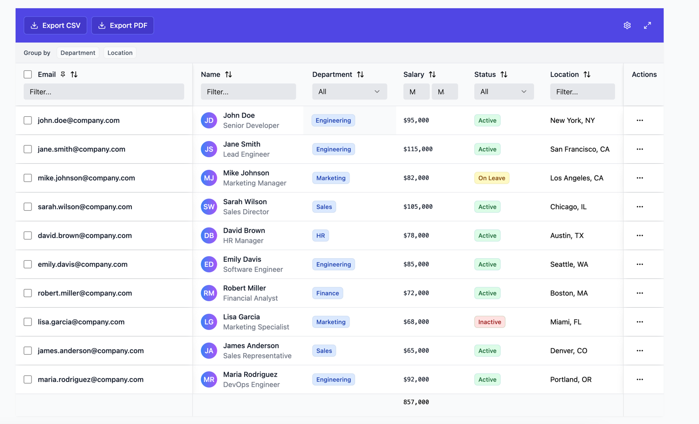

# Advanced React DataTable

A comprehensive React data grid component with advanced features like pinned columns, inline editing, grouping, filtering, and export capabilities.



## Installation

```bash
npm install advanced-react-datatable
```

## Quick Start

```tsx
import { DataTable } from 'advanced-react-datatable';

const data = [
  { id: 1, name: 'John Doe', email: 'john@example.com', department: 'Engineering' },
  { id: 2, name: 'Jane Smith', email: 'jane@example.com', department: 'Marketing' },
];

const columns = [
  { 
    field: 'selected', 
    header: 'Select', 
    useSelection: true, 
    pinned: 'left', 
    width: 50 
  },
  { field: 'name', header: 'Name', sortable: true, filterable: true },
  { field: 'email', header: 'Email', sortable: true, filterable: true },
  { 
    field: 'department', 
    header: 'Department', 
    sortable: true, 
    filterable: true, 
    groupable: true 
  },
  {
    field: 'salary',
    header: 'Salary',
    type: 'number',
    sortable: true,
    filterable: true,
    aggregation: 'sum' // Show sum in footer
  }
];

function App() {
  return (
    <DataTable
      data={data}
      columns={columns}
      pageSize={10}
      showFilters={true}
      selectionMode="multiple"
      stickyHeader={true}
      stickyFooter={true}
    />
  );
}
```

## Features

- **Selection System**: Tailwind-based checkbox selection tied to column definitions with `useSelection` property
- **Sticky Headers/Footers**: Configurable sticky positioning for headers and footers
- **Aggregation Functions**: Built-in aggregation functions (count, sum, avg, min, max) applied only when defined in column properties
- **Modern Grid Layout**: CSS Grid-based layout with proper column alignment and pinned column support
- **Pure Tailwind CSS**: No external CSS dependencies for maximum customization flexibility
- **Advanced Filtering**: Column-specific filters with operators (contains, equals, etc.)
- **Multi-Level Grouping**: Group by multiple columns with hierarchical display
- **Pinned Columns**: Pin columns to left or right side
- **Inline Editing**: Double-click cells to edit values
- **Export**: CSV and PDF export capabilities
- **Responsive Design**: Mobile-friendly with horizontal scrolling
- **TypeScript**: Full type safety and IntelliSense support

## Styling

The component uses Tailwind CSS classes for styling and does not require any additional CSS files. All UI components are built with Headless UI primitives instead of @radix-ui for better performance and smaller bundle size.

### Custom Styling

You can customize the DataTable appearance by overriding the Tailwind classes or using the `className` prop:

```tsx
<DataTable
  data={data}
  columns={columns}
  className="border-2 border-gray-300 rounded-lg"
/>
```

### Tailwind CSS Classes Used

The component uses standard Tailwind CSS classes for styling:

- **Container**: `bg-white rounded-lg overflow-hidden`
- **Action Bar**: `bg-gradient-to-r from-blue-600 to-blue-500 p-4 flex items-center justify-between`
- **Header**: `bg-gray-50 sticky top-0 z-30`
- **Rows**: `transition-colors hover:bg-gray-50`
- **Filters**: `px-3 py-2 border border-gray-300 rounded-md text-sm`
- **Pagination**: `flex items-center justify-between p-4 bg-gray-50 border-t`

### Theme Customization

You can customize colors and styling by modifying your Tailwind configuration or using CSS custom properties.

## Column Configuration

### Column Properties

#### useSelection
Enable checkbox selection for a column:

```tsx
{
  field: 'selected',
  header: 'Select',
  useSelection: true,
  pinned: 'left',
  width: 50
}
```

#### aggregation
Define aggregation functions for footer calculations:

```tsx
{
  field: 'salary',
  header: 'Salary',
  type: 'number',
  aggregation: 'sum' // Options: 'count', 'sum', 'avg', 'min', 'max'
}
```

#### stickyFooter
Enable sticky footer for the DataTable:

```tsx
<DataTable
  data={data}
  columns={columns}
  stickyFooter={true}
/>
```

### valueGetter Property

The `valueGetter` property allows you to define custom value extraction for sorting, filtering, and grouping:

```tsx
const columns = [
  {
    field: 'fullName',
    header: 'Full Name',
    sortable: true,
    filterable: true,
    groupable: true,
    valueGetter: (row) => `${row.firstName} ${row.lastName}`, // Custom value
  },
  {
    field: 'status',
    header: 'Status',
    sortable: true,
    filterable: true,
    valueGetter: (row) => row.active ? 'Active' : 'Inactive', // Boolean to string
  },
  {
    field: 'totalSales',
    header: 'Total Sales',
    sortable: true,
    type: 'number',
    valueGetter: (row) => row.sales.reduce((sum, sale) => sum + sale.amount, 0), // Calculated value
  },
];
```

**Priority**: `valueGetter` has higher priority than the `field` property. If `valueGetter` is defined, it will be used for sorting, filtering, and grouping operations.

## API Reference

### DataTable Props

| Prop | Type | Default | Description |
|------|------|---------|-------------|
| `data` | `T[]` | **Required** | Array of data objects to display |
| `columns` | `DataTableColumn<T>[]` | **Required** | Column definitions array |
| `groupBy` | `string \| string[]` | `undefined` | Fields to group by (supports multi-level grouping) |
| `virtualScrolling` | `boolean` | `false` | Enable virtual scrolling for large datasets |
| `selectionMode` | `'single' \| 'multiple' \| 'none'` | `'none'` | Row selection mode |
| `stickyHeader` | `boolean` | `true` | Keep header visible during scrolling |
| `showFilters` | `boolean` | `true` | Show column filters in header |
| `showColumnConfig` | `boolean` | `true` | Show column configuration modal |
| `pageSize` | `number` | `10` | Number of rows per page |
| `className` | `string` | `undefined` | Additional CSS classes for container |
| `enablePdfExport` | `boolean` | `false` | Enable PDF export button (requires PDF library) |
| `onRowSelect` | `(rows: T[]) => void` | `undefined` | Callback when rows are selected |
| `onExport` | `(data: T[], format: 'csv' \| 'pdf') => void` | `undefined` | Callback for export actions |
| `onColumnChange` | `(columns: DataTableColumn<T>[]) => void` | `undefined` | Callback when columns are reordered/configured |
| `onCellEdit` | `(row: T, field: keyof T, value: any) => void` | `undefined` | Callback when cell is edited |

### Column Definition

```tsx
interface DataTableColumn<T> {
  field: keyof T                                    // Field name from data object
  header: string                                    // Display name for column header
  sortable?: boolean                               // Enable sorting (default: false)
  filterable?: boolean                             // Enable filtering (default: false)
  groupable?: boolean                              // Enable grouping (default: false)
  pinned?: 'left' | 'right' | null                // Pin column to side (default: null)
  type?: 'text' | 'number' | 'date' | 'select' | 'boolean'  // Data type for filtering/editing
  width?: number                                   // Fixed column width in pixels
  minWidth?: number                                // Minimum column width in pixels
  maxWidth?: number                                // Maximum column width in pixels
  hidden?: boolean                                 // Hide column (default: false)
  editable?: boolean                               // Enable inline editing (default: false)
  cellRenderer?: (value: any, row: T) => React.ReactNode  // Custom cell renderer
  headerRenderer?: (column: DataTableColumn<T>) => React.ReactNode  // Custom header renderer
  valueGetter?: (row: T) => any                    // Custom value extraction for sorting/filtering
  options?: string[]                               // Options for select type columns
}
```

### Advanced Examples

#### Custom Cell Rendering

```tsx
const columns = [
  {
    field: 'status',
    header: 'Status',
    type: 'select',
    cellRenderer: (value, row) => (
      <span className={`badge ${value === 'active' ? 'badge-success' : 'badge-danger'}`}>
        {value}
      </span>
    )
  },
  {
    field: 'avatar',
    header: 'User',
    cellRenderer: (value, row) => (
      <div className="flex items-center gap-2">
        
        <span>{row.name}</span>
      </div>
    )
  }
];
```

#### Pinned Columns

```tsx
const columns = [
  {
    field: 'id',
    header: 'ID',
    pinned: 'left',
    width: 80
  },
  {
    field: 'name',
    header: 'Name',
    pinned: 'left',
    minWidth: 200
  },
  {
    field: 'email',
    header: 'Email',
    filterable: true,
    sortable: true
  },
  {
    field: 'actions',
    header: 'Actions',
    pinned: 'right',
    width: 100,
    cellRenderer: (value, row) => (
      <button onClick={() => editRow(row)}>Edit</button>
    )
  }
];
```

#### Multi-Level Grouping

```tsx
<DataTable
  data={employees}
  columns={columns}
  groupBy={['department', 'location']}  // Group by department, then by location
  showFilters={true}
/>
```

#### Event Handling

```tsx
function MyComponent() {
  const handleRowSelect = (selectedRows) => {
    console.log('Selected rows:', selectedRows);
  };

  const handleCellEdit = (row, field, value) => {
    console.log(`Updated ${field} to ${value} for row:`, row);
    // Update your data source here
  };

  const handleExport = (data, format) => {
    if (format === 'csv') {
      // Handle CSV export
      const csvContent = convertToCSV(data);
      downloadFile(csvContent, 'data.csv');
    }
  };

  return (
    <DataTable
      data={data}
      columns={columns}
      selectionMode="multiple"
      onRowSelect={handleRowSelect}
      onCellEdit={handleCellEdit}
      onExport={handleExport}
    />
  );
}
```

## Version

Current version: 1.8.0

## Support

For issues and questions, please visit our [GitHub repository](https://github.com/denishuk/dataGrid).